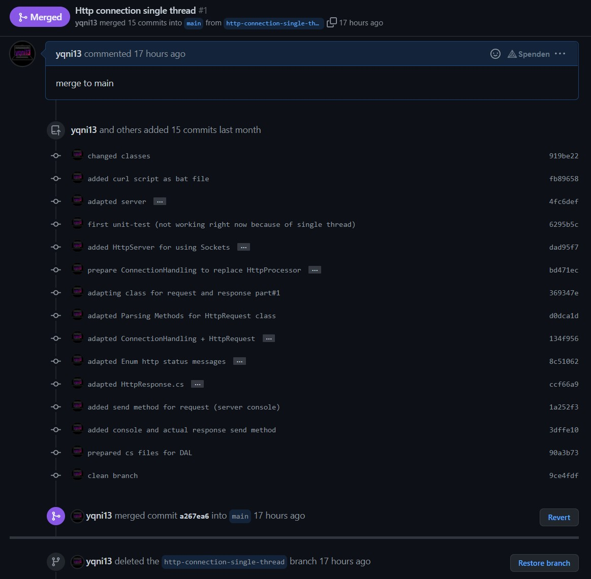
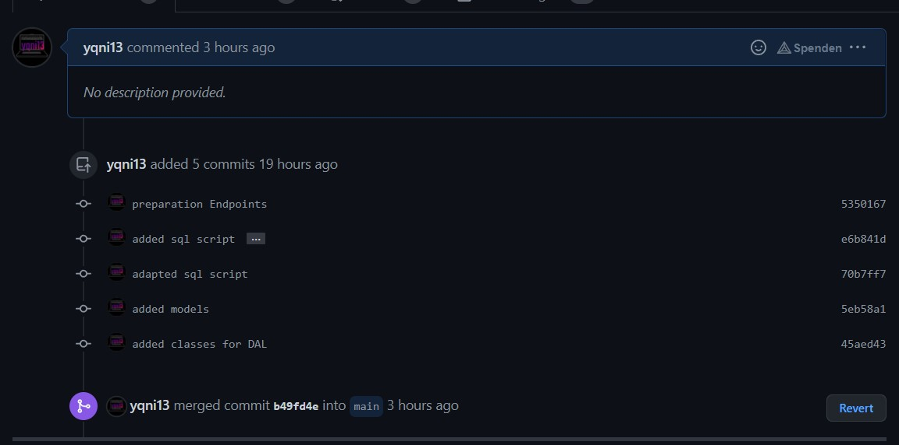
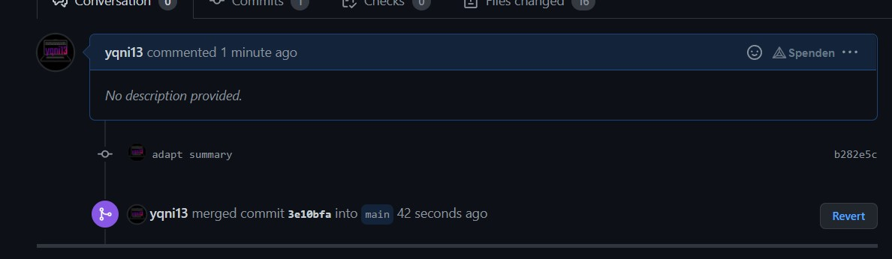

### Software Engineering Class 1, FH Technikum Wien, Computer Science, Semester #3

## final C# project - MTCG (Monster Trading Card Game)

---

link of repository on GitHub:
https://github.com/if20b167/MTCG

##Technical steps

#Designs
The system uses the combination of Data Access Layer (db access and operations), Business Layer via models and endpoints as well as a Presentation Layer (gateways for server connection and communication). Standard exceptions and serialization are implied too.

#Failures
At the beginning I wanted to use Repositorys for the communication of the database by implementing the regarding interfaces which led to a complete chaos. Also the connection to the database should be controlled by an own class to ensure there is only a single connection existing, but couldn't figure out a good solution for this.

#Selected Solutions
Singleton pattern is used for starting the server.
DB - script was created by using Datagrip, Information from the internet and a lot of trial and error. The db itself runs as postgreSQL. 

##Unit-Tests
Not implemented.
Focus was to test parts of the DAL, Models and DB because the http server isn't easy to test and battle logic misses too much of content.

##Leasons learned
Because of missing knowledge from SWEN1 course and less practice did I underestimate the effort again. Especially the http server and database took me more time than thought which resulted in doubt and postponing because of small steps forward which led to missing time, again.

Unit Tests should be done parallel to the project, but with the long time effort of http server there was not much to test at the time which led to writing most of the unit tests at the end. Furthermore do many problems exist (dependencies, private methods and so forth) which interfere with easy testing.

Working with a development/2nd branch was a nice experience which will be used regularly from now on. At first I tried to use a branch for an feature/part of the work each but the dev-branch makes more sense.

Working on this project shows me missing practical experience in working with databases and the planing of a structure combining endpoints, the data access layer and business(battle) logic which needs to be improved.

##Timetrack
~ 3,5h Documentation
~25,0h HTTP
~ 6,5h Unit-Tests
~16,0h DB/DAL

##Git-History
Created new GitHub Account to hide half-finished project from my official timeline. Therefore screenshots of Git-History is added below to show workflow.

