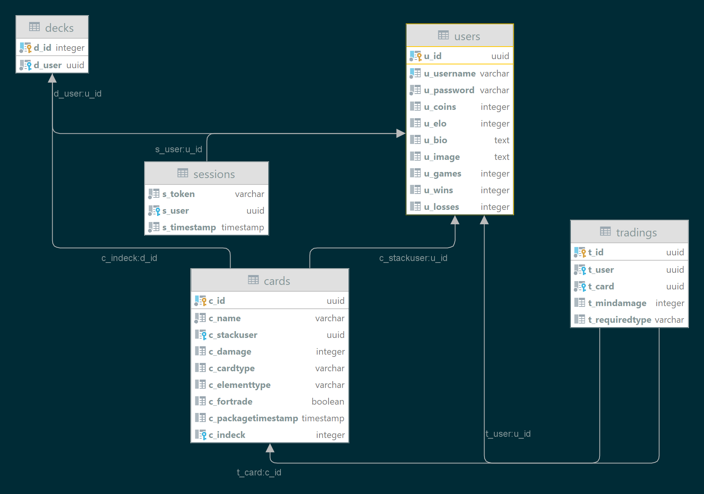

### Software Engineering Class 1, FH Technikum Wien, Computer Science, Semester #3

## final C# project - MTCG (Monster Trading Card Game)

---
Lukas Varga, if20b167
link of repository on GitHub:
https://github.com/yqni13/MTCG

##Technical steps

#Designs
Project coded in C#. Using TCP-Communication like in example from study courses. 
The system uses the combination of Data Access Layer (db access and operations), Business Layer via models, services and endpoints as well as a Presentation Layer (gateways for server connection and communication). Standard exceptions and serialization are implemented too.

#Failures
Out of the given endpoints from the used curl-script, only /tradings has not been implemented. Every endpoint responses to the given requests with the dedicated status message and body.

#Selected Solutions
Singleton pattern is used for starting the server.
DB - script was created by using VisualStudio and Datagrip, Information from the internet and a lot of trial and error. The db itself runs on postgresql controlled by command line. For controlling the endpoints I used the Endpoint Attributes.

![db structure]

##Unique Feature

As a unique feature, after battle the regarding BattleLog will be saved into a .txt file inside the directory 'BattleLogs' within the same directory level as the software layers.

##Unit-Tests
22 Unit-Tests in total
10 Unit-Tests for testing the BattleLogic
06 Unit-Tests for testing the CardLogic
06 Unit-Tests for testing the UserLogic

Unit-Tests have been implemented by using the NUnit Framework.
The integration was focused on testing the battle logic because of the many conditions to change the damage calculation. Furthermore a few Asserts to check for exceptions while communicating with the database were tested. Additionally operations for registration and login of users are checked to get the correct results or exceptions. The difference to working with the curl script is more precise results to expect and hint what to debug. Mostly preferred working with the Postman which is the most important tool for debugging.

##Leasons learned

- Unit tests should be implemented a more parallel way of programming because of its way to show fail/success for the implementation instead of doing it at the end of the project (missing the advantages) and needed to change some methods enabling test cases. Because of time problems (being the first bigger project with C#) Unit-Tests have been of less priority

- Time management is the most important part, because the projects need much time for research and debugging while having less experience

- using source code management for constant developing was helpful to structure processes and overview the changes in code, because you need to check what has been before and working with the tools (commandline or desktop launcher) has been a great learning experience

- Working on this project shows me missing practical experience in working with databases and the planing of a structure combining endpoints, the data access layer and business(battle) logic which needs to be improved.

##Timetrack
05:29:00 Documentation
26:41:00 HTTP
12:54:00 DB
02:17:00 Curl-Script
35:54:00 Business Logic
06:49:00 Unit-Tests
90:04:00 Summe